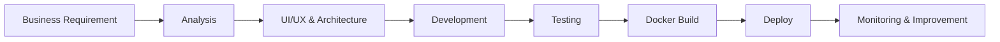

<!--
  m-creasoft | Company / Organization README
  Website: https://aqy.vn
  Email: buiyen4696@gmail.com
-->

<div align="center">


### 🚀 Đơn vị cung cấp giải pháp phần mềm & chuyển đổi số

**Biến ý tưởng thành sản phẩm số — xây dựng hệ thống ổn định, dễ mở rộng và sẵn sàng vận hành thực tế.**

<br/>

[](https://aqy.vn)
[](mailto:buiyen4696@gmail.com)
[](https://aqy.vn)

</div>

---

## 👋 Về m-creasoft

**m-creasoft** tập trung phát triển các sản phẩm phần mềm phục vụ hoạt động quản lý, vận hành và chuyển đổi số cho doanh nghiệp.

Chúng tôi hướng đến việc xây dựng những hệ thống:

- ⚡ **Nhanh & ổn định** trong quá trình vận hành.
- 🧩 **Module hóa**, dễ nâng cấp và mở rộng theo nghiệp vụ.
- 🔐 **An toàn**, hỗ trợ xác thực và phân quyền tập trung.
- ☁️ **Cloud-ready**, phù hợp triển khai Docker / Kubernetes.
- 📊 **Data-driven**, sẵn sàng tích hợp nhiều nguồn dữ liệu.
- 🔌 **API-first**, thuận lợi kết nối hệ thống bên thứ ba.

> **Build software that solves real business problems.**

---

## 💼 Giải pháp & sản phẩm

<table>
  <tr>
    <td width="50%" valign="top">
      <h3>🚗 Quản lý đào tạo lái xe</h3>
      <p>
        Giải pháp hỗ trợ quản lý học viên, khóa đào tạo, tiến độ học tập,
        hồ sơ, chi phí, thanh toán và các nghiệp vụ liên quan đến trung tâm đào tạo.
      </p>
      <strong>Focus:</strong> Training Management • Student Management • Operations
    </td>
    <td width="50%" valign="top">
      <h3>🔐 Giải pháp xác thực SSO</h3>
      <p>
        Hệ thống đăng nhập tập trung giúp nhiều ứng dụng sử dụng chung cơ chế
        xác thực, phân quyền và quản lý danh tính.
      </p>
      <strong>Focus:</strong> SSO • Authentication • Authorization • API Security
    </td>
  </tr>

  <tr>
    <td width="50%" valign="top">
      <h3>🏸 Quản lý sân cầu lông</h3>
      <p>
        Giải pháp quản lý sân, lịch đặt sân, khách hàng, ghép sân,
        thanh toán và vận hành trên nền tảng Web / Mobile.
      </p>
      <strong>Focus:</strong> Booking • Court Management • Customer Experience
    </td>
    <td width="50%" valign="top">
      <h3>🌐 Dịch vụ thiết kế Website</h3>
      <p>
        Thiết kế và phát triển website doanh nghiệp, landing page,
        hệ thống quản trị và các web application theo yêu cầu.
      </p>
      <strong>Focus:</strong> UI/UX • Next.js • Business Website • Web App
    </td>
  </tr>

  <tr>
    <td width="50%" valign="top">
      <h3>💳 Giải pháp thanh toán từ xa</h3>
      <p>
        Xây dựng luồng thanh toán trực tuyến, liên kết giao dịch,
        đối soát và tích hợp các nền tảng thanh toán vào hệ thống nghiệp vụ.
      </p>
      <strong>Focus:</strong> Payment Integration • Remote Payment • Transaction
    </td>
    <td width="50%" valign="top">
      <h3>🧠 Phần mềm theo yêu cầu</h3>
      <p>
        Phân tích nghiệp vụ, thiết kế kiến trúc và phát triển phần mềm
        phù hợp với quy trình riêng của từng doanh nghiệp.
      </p>
      <strong>Focus:</strong> Custom Software • API • Automation • Integration
    </td>
  </tr>
</table>

---

## 🛠 Technology Stack

<div align="center">

### Backend


<br/><br/>

### Frontend


<br/><br/>

### Database & Object Storage


&nbsp;&nbsp;

&nbsp;&nbsp;


<br/><br/>

### DevOps & Infrastructure


</div>

<br/>

<div align="center">


</div>

---

## 🏗️ Kiến trúc chúng tôi hướng tới

```text
                        ┌──────────────────────────────┐
                        │         Web / Mobile         │
                        │       Next.js / React        │
                        └──────────────┬───────────────┘
                                       │
                                       ▼
                        ┌──────────────────────────────┐
                        │        API / Gateway         │
                        │          C# / .NET           │
                        └───────┬──────────┬───────────┘
                                │          │
                    ┌───────────┘          └────────────┐
                    ▼                                    ▼
          ┌──────────────────┐                 ┌──────────────────┐
          │   SQL Server     │                 │     MongoDB      │
          │ Transaction Data │                 │ Flexible Data    │
          └──────────────────┘                 └──────────────────┘
                    │
                    ▼
          ┌──────────────────┐
          │      MinIO       │
          │ Object / Files   │
          └──────────────────┘

                    Deployment & Operations
                            │
                            ▼
              ┌──────────────────────────┐
              │ Docker • Kubernetes • CI │
              └──────────────────────────┘
```

---

## 🎯 Năng lực triển khai

| Năng lực | Mô tả |
|---|---|
| 🧭 **Phân tích nghiệp vụ** | Chuyển yêu cầu vận hành thực tế thành luồng nghiệp vụ và đặc tả hệ thống |
| 🎨 **UI/UX & Web App** | Xây dựng giao diện hiện đại, responsive và tối ưu trải nghiệm người dùng |
| ⚙️ **Backend & API** | Phát triển API, business logic, phân quyền và tích hợp hệ thống |
| 🗄️ **Database Design** | Thiết kế dữ liệu phù hợp cho hệ thống nghiệp vụ và khả năng mở rộng |
| 🔐 **SSO & Security** | Xác thực tập trung, token, authorization và bảo mật API |
| 🐳 **Containerization** | Chuẩn hóa môi trường bằng Docker |
| ☸️ **Orchestration** | Triển khai và vận hành hệ thống với Kubernetes |
| 📦 **Object Storage** | Quản lý file và dữ liệu lớn qua MinIO |
| 🔗 **System Integration** | Kết nối thanh toán, API đối tác và các hệ thống bên thứ ba |

---

## 🔄 Quy trình phát triển



**Requirement → Architecture → Development → Testing → Deployment → Improvement**

---

## ⭐ Giá trị m-creasoft hướng tới

<div align="center">

| 🎯 Business First | 🧩 Scalable | 🔐 Secure | ⚡ Performance | 🤝 Long-term |
|:---:|:---:|:---:|:---:|:---:|
| Bám sát nghiệp vụ | Dễ mở rộng | Bảo mật từ thiết kế | Tối ưu vận hành | Đồng hành lâu dài |

</div>

---

## 📫 Liên hệ

<div align="center">

### Bạn đang có một ý tưởng hoặc bài toán cần số hóa?

**Hãy cùng m-creasoft biến nó thành một sản phẩm có thể vận hành thực tế.**

<br/>

🌐 **Website:** [aqy.vn](https://aqy.vn)  
📧 **Email:** [buiyen4696@gmail.com](mailto:buiyen4696@gmail.com)

<br/>

[](https://aqy.vn)
[](mailto:buiyen4696@gmail.com)

</div>

---

<div align="center">

### M-CREASOFT

**Software Solutions • Digital Products • Business Automation**

<sub>Built with ❤️ for real-world businesses.</sub>

<br/><br/>


</div>
